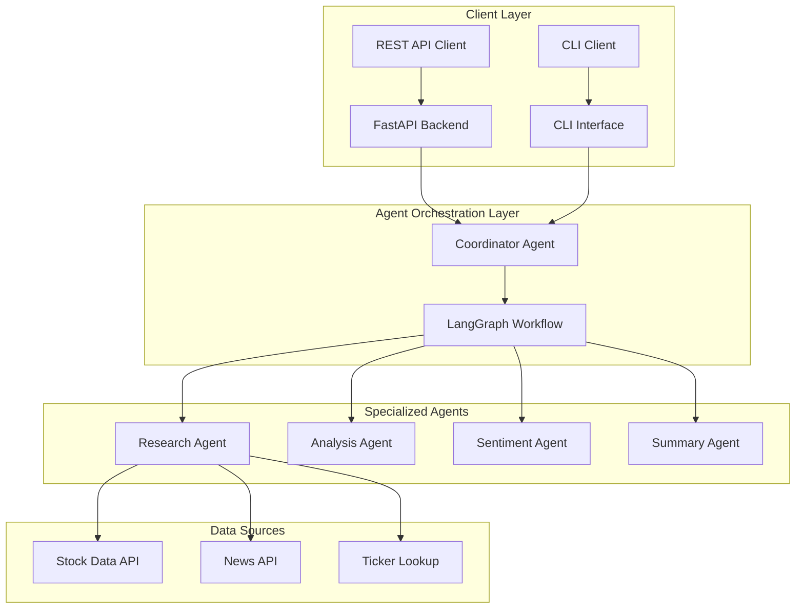

# AI Stock Agent

A sophisticated AI-powered stock analysis platform featuring a complete agent-based architecture with LangChain/LangGraph orchestration. The system provides both FastAPI REST endpoints and a command-line interface for comprehensive stock market analysis.

## 🏗️ Architecture Overview

**Complete Agent-Based System**: Every component is an intelligent agent that collaborates through LangGraph workflows:



## 📁 Project Structure

```
ai-stock-agent/
├── app.py                           # Unified FastAPI Backend + CLI Interface
├── models/                          # Data Models & Schemas
│   ├── __init__.py
│   └── models.py                   # Unified StockAgentModels class
├── agents/                          # AI Agents & Orchestration
│   ├── __init__.py
│   ├── coordinator_agent.py        # LangGraph workflow coordinator
│   ├── ticker_lookup_agent.py      # Company/ticker resolution agent
│   ├── research_agent.py           # Data collection & research agent
│   ├── analysis_agent.py           # Technical analysis agent
│   ├── sentiment_agent.py          # News sentiment analysis agent
│   └── summarization_agent.py      # Final summary generation agent
├── services/                        # External Services Integration
│   ├── __init__.py
│   ├── stock_data.py               # Stock market data fetching service
│   └── news_fetcher.py             # News article collection service
├── utils/                           # Utility Functions
│   ├── __init__.py
│   └── utils.py                    # Helper functions & formatting
├── env.example                      # Environment variables template
├── requirements.txt                 # Python dependencies
└── README.md                       # This file
```

## 🔧 LangChain & LangGraph Architecture

### How LangChain is Used

**LangChain** provides the foundation for our AI agent system:

1. **LLM Integration**: Each agent uses `ChatOpenAI` from LangChain to interact with GPT-4
2. **Agent Framework**: Agents use LangChain's agent framework with tools and memory
3. **Prompt Templates**: Structured prompts using `ChatPromptTemplate` and `MessagesPlaceholder`
4. **Memory Management**: Each agent has `ConversationBufferMemory` for context retention
5. **Tool Integration**: Custom tools for stock data, news fetching, and ticker lookup

### How LangGraph is Used

**LangGraph** orchestrates the entire workflow as a state machine:

1. **State Management**: `GraphState` tracks the complete workflow state
2. **Workflow Orchestration**: Sequential execution of agents through defined nodes
3. **Error Handling**: Robust error propagation and state recovery
4. **Parallel Processing**: Efficient execution of independent tasks

### Agent Workflow

```mermaid
graph TB
    A[Initialize] --> B[Ticker Lookup Agent]
    B --> C[Research Agent]
    C --> D[Analysis Agent]
    D --> E[Sentiment Agent]
    E --> F[Summarization Agent]
    F --> G[Finalize]
    
    subgraph "LangGraph State Machine"
        H[GraphState] --> I[WorkflowState]
        I --> J[Agent Responses]
        J --> K[Final Summary]
```

## 🚀 Quick Start

### Prerequisites
- Python 3.8+
- OpenAI API key (required)
- NewsAPI key (optional, for enhanced news coverage)

### Installation

1. **Clone the repository**:
```bash
git clone https://github.com/your-username/ai-stock-agent.git
cd ai-stock-agent
```

2. **Create virtual environment**:
```bash
python -m venv venv
source venv/bin/activate
```

3. **Install dependencies**:
```bash
pip install -r requirements.txt
```

4. **Configure environment**:
```bash
cp env.example .env
# Edit .env with your API keys
```

5. **Required environment variables**:
```env
OPENAI_API_KEY=your_openai_api_key_here
NEWS_API_KEY=your_news_api_key_here  # Optional
```

### Usage

#### Option 1: FastAPI Server (Recommended)

Start the server:
```bash
uvicorn app:app --host 0.0.0.0 --port 8000 --reload
```

Access the interactive API documentation at: `http://localhost:8000/docs`

#### Option 2: Command Line Interface

```bash
# Interactive mode
python app.py

# Direct query
python app.py --query "Tell me about Apple stock"

# Batch analysis
python app.py --batch "Apple,Microsoft,Google"

# Custom output format
python app.py --query "TSLA analysis" --format json

# Verbose output
python app.py --query "Amazon stock" --verbose
```

#### Option 3: Python Library

Use as a Python library:

```python
import asyncio
from app import analyze_stock_simple

async def main():
    result = await analyze_stock_simple("Tell me about Apple stock")
    print(result)

asyncio.run(main())
```

## 🔌 API Endpoints

### 1. Stock Analysis
```bash
curl -X POST "http://localhost:8000/analyze" \
-H "Content-Type: application/json" \
-d '{"query": "Tell me about Apple stock"}'
```

### 2. Batch Analysis
```bash
curl -X POST "http://localhost:8000/batch-analyze" \
-H "Content-Type: application/json" \
-d '{"queries": ["Apple stock", "Microsoft analysis", "Google trends"]}'
```

### 3. Ticker Validation
```bash
curl -X POST "http://localhost:8000/validate-ticker" \
-H "Content-Type: application/json" \
-d '{"company_name": "Apple"}'
```

### 4. Health Check
```bash
curl "http://localhost:8000/health"
```

## 🤖 Agent Architecture

### 🎯 Coordinator Agent (LangGraph)
**Role**: Orchestrates the entire analysis workflow using LangGraph
**Responsibilities**:
- Manages agent communication and state through LangGraph state machine
- Coordinates sequential execution of specialized agents
- Handles error recovery and retry logic
- Optimizes workflow execution and resource management

```python
class CoordinatorAgent:
    def __init__(self):
        self.workflow = self._build_workflow()  # LangGraph StateGraph
        self.ticker_lookup_agent = TickerLookupAgent()
        self.research_agent = ResearchAgent()
        self.analysis_agent = AnalysisAgent()
        self.sentiment_agent = SentimentAgent()
        self.summarization_agent = SummarizationAgent()
        self.app = self.workflow.compile()  # Compile LangGraph workflow
```

### 🔍 Ticker Lookup Agent
**Role**: Resolves company names to stock ticker symbols
**Capabilities**:
- Company name parsing and normalization
- Ticker symbol resolution with high accuracy
- Fuzzy matching for ambiguous company names
- Suggestion generation for failed lookups
- AI-assisted company name extraction from natural language

```python
class TickerLookupAgent:
    def __init__(self):
        # No configuration required - simplified initialization
        self.llm = ChatOpenAI(model="gpt-4", temperature=0.1)
    
    async def resolve_company_ticker(self, query: str) -> Dict[str, Any]:
        # AI-powered ticker resolution
        return await self._ai_assisted_lookup(query)
```

### 📊 Research Agent (Refactored Architecture)
**Role**: Comprehensive data collection using specialized tools
**Key Features**:
- **Tool-Based Architecture**: Uses specialized tools that directly access services
- **No Data Duplication**: Single source of truth for data fetching
- **Clean Separation**: Tools handle data fetching, agent handles orchestration

**Tool Architecture**:
```python
class StockDataTool(BaseTool):
    """Directly accesses StockDataFetcher service"""
    def __init__(self):
        self.fetcher = StockDataFetcher()
    
    def _run(self, ticker: str, company_name: str, days: int = 7):
        # Direct service access with model conversion
        data = self.fetcher.get_comprehensive_data(ticker, company_name, days)
        return self._convert_to_stock_data_model(data)

class NewsDataTool(BaseTool):
    """Directly accesses NewsFetcher service"""
    def __init__(self):
        self.fetcher = NewsFetcher()
    
    def _run(self, company_name: str, ticker: str, limit: int = 5):
        # Direct service access with model conversion
        articles = self.fetcher.get_company_news(company_name, ticker, limit)
        return self._convert_to_news_data_model(articles)
```

**Research Agent**:
```python
class ResearchAgent:
    def __init__(self):
        # Simplified - no configuration required
        self.tools = [StockDataTool(), NewsDataTool()]
        self.llm = ChatOpenAI(model="gpt-4", temperature=0.3)
    
    async def research_company(self, context: Dict[str, Any]) -> Dict[str, Any]:
        # Use tools to fetch data (no duplicate methods)
        stock_tool = self._get_tool_by_name("stock_data_fetcher")
        news_tool = self._get_tool_by_name("news_data_fetcher")
        
        # Execute tools for data collection
        stock_result = await stock_tool._arun(ticker, company_name)
        news_result = await news_tool._arun(company_name, ticker)
        
        return self._compile_research_results(stock_result, news_result)
```

### 📈 Analysis Agent
**Role**: Performs comprehensive technical analysis
**Capabilities**:
- Price trend analysis and pattern recognition
- Technical indicators calculation
- Support/resistance level identification
- Volume analysis and momentum assessment
- Volatility and risk metric calculation

```python
class AnalysisAgent:
    def __init__(self):
        # Simplified initialization - no config required
        self.llm = ChatOpenAI(model="gpt-4", temperature=0.7)
    
    async def analyze_stock(self, stock_data: StockData) -> Dict[str, Any]:
        # Comprehensive technical analysis using GPT-4
        analysis_input = self._prepare_analysis_input(stock_data)
        result = await self.llm.ainvoke([
            SystemMessage(content=self.prompt.messages[0].content),
            HumanMessage(content=f"Analyze: {analysis_input}")
        ])
        return await self._process_analysis_result(result, stock_data)
```

### 📰 Sentiment Agent
**Role**: News sentiment analysis and theme extraction
**Capabilities**:
- Multi-article sentiment analysis
- Financial news interpretation
- Key theme and topic extraction
- Market impact assessment
- Sentiment scoring and classification

```python
class SentimentAgent:
    def __init__(self):
        # Simplified initialization
        self.llm = ChatOpenAI(model="gpt-4", temperature=0.5)
    
    async def analyze_sentiment(self, news_data: NewsData) -> Dict[str, Any]:
        # Analyze sentiment of multiple news articles
        sentiment_input = self._prepare_sentiment_input(news_data)
        result = await self.llm.ainvoke([
            SystemMessage(content=self.prompt.messages[0].content),
            HumanMessage(content=f"Analyze sentiment: {sentiment_input}")
        ])
        return await self._process_sentiment_result(result, news_data)
```

### 📝 Summarization Agent
**Role**: Creates comprehensive natural language summaries
**Capabilities**:
- Executive summary generation
- Multi-source data synthesis
- Risk assessment compilation
- Actionable insights extraction
- Professional report formatting

```python
class SummarizationAgent:
    def __init__(self):
        # Simplified initialization
        self.llm = ChatOpenAI(model="gpt-4", temperature=0.6)
    
    async def create_summary(self, workflow_state: WorkflowState) -> Dict[str, Any]:
        # Create comprehensive summary from all analysis data
        summary_input = self._prepare_summary_input(workflow_state)
        result = await self.llm.ainvoke([
            SystemMessage(content=self.prompt.messages[0].content),
            HumanMessage(content=f"Create summary: {summary_input}")
        ])
        return await self._process_summary_result(result, workflow_state)
```

## 🔐 Configuration

### Simplified Environment Configuration

The system now uses a streamlined configuration approach with minimal required settings:

```env
# ===============================================================================
# STOCK SUMMARY AGENT - ENVIRONMENT CONFIGURATION
# ===============================================================================

# OpenAI API Configuration (REQUIRED)
OPENAI_API_KEY=your_openai_api_key_here

# NewsAPI Configuration (OPTIONAL - for enhanced news coverage)
# Get your free API key from: https://newsapi.org/register
NEWS_API_KEY=your_news_api_key_here

# ===============================================================================
# BASIC CONFIGURATION
# ===============================================================================

# Default number of days for stock analysis
STOCK_AGENT_DEFAULT_ANALYSIS_DAYS=7

# Maximum number of news articles to fetch
STOCK_AGENT_MAX_NEWS_ARTICLES=5

# ===============================================================================
# LLM CONFIGURATION
# ===============================================================================

# OpenAI Model Configuration
OPENAI_MODEL=gpt-4
OPENAI_TEMPERATURE=0.7
OPENAI_MAX_TOKENS=1000

# ===============================================================================
# FASTAPI CONFIGURATION
# ===============================================================================

# FastAPI server configuration
FASTAPI_HOST=0.0.0.0
FASTAPI_PORT=8000
FASTAPI_RELOAD=true

# ===============================================================================
# SYSTEM CONFIGURATION
# ===============================================================================

# Logging level (DEBUG, INFO, WARNING, ERROR)
LOG_LEVEL=INFO

# Enable verbose logging for debugging
VERBOSE_LOGGING=false

# Maximum retry attempts for failed operations
MAX_RETRY_ATTEMPTS=3

# Timeout for agent operations (in seconds)
AGENT_TIMEOUT_SECONDS=30

# ===============================================================================
# DEVELOPMENT CONFIGURATION
# ===============================================================================

# Enable development mode (more verbose logging, relaxed error handling)
DEVELOPMENT_MODE=false

# Enable debug mode for agents
DEBUG_AGENTS=false
```

### Key Simplifications:
- **No agent-specific configurations** (temperatures are hardcoded in agents)
- **No complex caching configuration** (kept simple)
- **No unnecessary data source toggles** (services handle availability automatically)
- **No performance tuning knobs** (sensible defaults)

## 🧪 Testing

### Unit Tests
```bash
# Test individual agents
python -m pytest tests/test_agents.py -v

# Test FastAPI endpoints
python -m pytest tests/test_api.py -v

# Test agent integration
python -m pytest tests/test_integration.py -v
```

### Quick API Test
```bash
# Test the main analysis endpoint
curl -X POST "http://localhost:8000/analyze" \
  -H "Content-Type: application/json" \
  -d '{"query": "Test Apple stock"}'

# Health check
curl "http://localhost:8000/health"
```

## 🛡️ Security & Rate Limiting

### 🔐 Authentication
```python
from fastapi import Depends, HTTPException, status
from fastapi.security import HTTPBearer, HTTPAuthorizationCredentials

security = HTTPBearer()

async def verify_token(credentials: HTTPAuthorizationCredentials = Depends(security)):
    if credentials.credentials != "your-secret-token":
        raise HTTPException(
            status_code=status.HTTP_401_UNAUTHORIZED,
            detail="Invalid authentication token"
        )
    return credentials.credentials
```

### 📊 Rate Limiting
```python
from slowapi import Limiter, _rate_limit_exceeded_handler
from slowapi.util import get_remote_address
from slowapi.errors import RateLimitExceeded

limiter = Limiter(key_func=get_remote_address)
app.state.limiter = limiter
app.add_exception_handler(RateLimitExceeded, _rate_limit_exceeded_handler)

@app.post("/analyze")
@limiter.limit("5/minute")
async def analyze_stock(request: Request, query: AnalysisRequest):
    # Analysis logic
    pass
```

## 🔧 Troubleshooting

### Common Issues

#### 1. **Agent Initialization Errors**
```bash
Error: Failed to initialize agents
Solution: Check OpenAI API key in .env file
```

#### 2. **FastAPI Server Issues**
```bash
Error: uvicorn: command not found
Solution: pip install uvicorn[standard]
```

#### 3. **Missing API Keys**
```bash
Error: OpenAI API key not found
Solution: Set OPENAI_API_KEY in .env file
```

#### 4. **News API Issues**
```bash
Error: News data unavailable
Solution: News API key is optional - system works without it
```

### Debug Mode
```bash
# Enable debug logging
export LOG_LEVEL=DEBUG
uvicorn app:app --reload --log-level debug

# Monitor agent performance
curl http://localhost:8000/health
```

## 🎯 Recent Improvements

### ✅ Architecture Refactoring (Latest)
- **Simplified Tool Architecture**: Tools now directly access services without redundancy
- **Removed Configuration Dependencies**: Agents no longer require complex configuration
- **Cleaner Separation of Concerns**: Tools handle data fetching, agents handle orchestration
- **Streamlined Environment Setup**: Minimal required configuration for easier setup

### ✅ Key Benefits
- **Reduced Complexity**: Fewer configuration options to manage
- **Better Maintainability**: Single source of truth for data fetching
- **Improved Performance**: Direct service access without unnecessary layers
- **Easier Deployment**: Simplified environment configuration

## 🎯 Roadmap

### Phase 3: Advanced Features
- [ ] **Real-time WebSocket streaming**
- [ ] **Multi-model agent support** (GPT-4, Claude, Gemini)
- [ ] **Advanced caching strategies**
- [ ] **Distributed agent processing**
- [ ] **Custom agent marketplace**

### Phase 4: Enterprise Features
- [ ] **Multi-tenant architecture**
- [ ] **Advanced analytics dashboard**
- [ ] **Custom model fine-tuning**
- [ ] **Enterprise SSO integration**
- [ ] **Audit logging and compliance**


**🎉 Ready to analyze stocks with AI agents? Start the FastAPI server and explore the interactive docs at http://localhost:8000/docs!**
