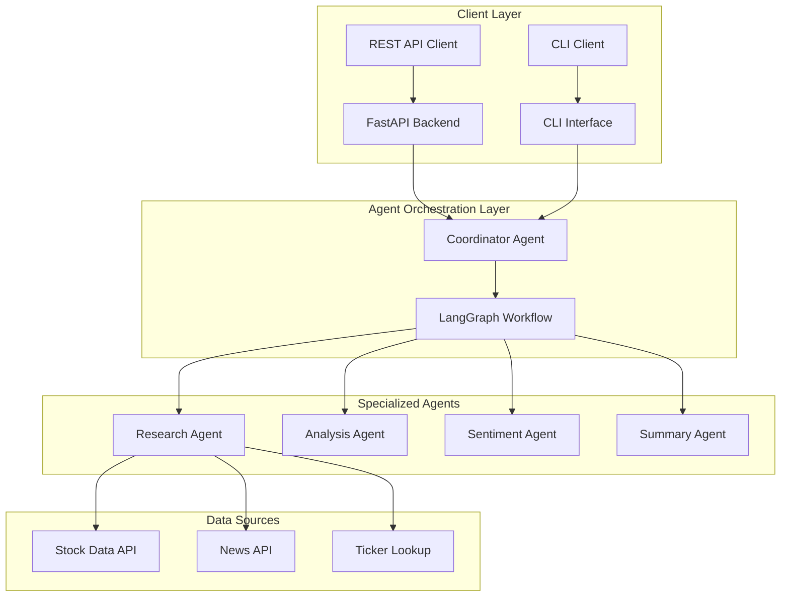

# AI Stock Agent

A sophisticated AI-powered stock analysis platform featuring a complete agent-based architecture with LangChain/LangGraph orchestration. The system provides both FastAPI REST endpoints and a command-line interface for comprehensive stock market analysis.

## 🏗️ Architecture Overview

**Complete Agent-Based System**: Every component is an intelligent agent that collaborates through LangGraph workflows:



## 📁 Project Structure

```
ai-stock-agent/
├── app.py                    # FastAPI Backend (REST API)
├── main.py                   # CLI Interface & Core Logic
├── models/                   # Data Models & Schemas
│   ├── __init__.py
│   └── models.py            # Unified StockAgentModels class
├── agents/                   # AI Agents & Orchestration
│   ├── __init__.py
│   ├── agents.py            # Specialized AI agents
│   └── coordinator.py       # LangGraph workflow coordinator
├── services/                 # External Services Integration
│   ├── __init__.py
│   ├── ticker_lookup.py     # Company/ticker resolution
│   ├── stock_data.py        # Stock market data fetching
│   └── news_fetcher.py      # News article collection
├── utils/                    # Utility Functions
│   ├── __init__.py
│   └── utils.py             # Helper functions & formatting
├── config/                   # Configuration
│   └── env.example          # Environment variables template
├── requirements.txt          # Python dependencies
└── README.md                # This file
```

## 🚀 Getting Started

### Prerequisites

- Python 3.8+
- OpenAI API key
- Required API keys (see Configuration section)

### Installation

1. **Clone the repository**
   ```bash
   git clone <repository-url>
   cd ai-stock-agent
   ```

2. **Create virtual environment**
   ```bash
   python -m venv venv
   source venv/bin/activate  # On Windows: venv\Scripts\activate
   ```

3. **Install dependencies**
   ```bash
   pip install -r requirements.txt
   ```

4. **Configure environment**
   ```bash
   cp config/env.example .env
   # Edit .env with your API keys
   ```

## 🔧 Configuration

Copy `config/env.example` to `.env` and configure:

```env
# Core Configuration
OPENAI_API_KEY=your_openai_api_key_here
LANGCHAIN_API_KEY=your_langchain_api_key_here
LANGCHAIN_TRACING_V2=true
LANGCHAIN_PROJECT=ai-stock-agent

# FastAPI Configuration
FASTAPI_HOST=0.0.0.0
FASTAPI_PORT=8000
FASTAPI_RELOAD=true

# Stock Data Configuration
ALPHA_VANTAGE_API_KEY=your_alpha_vantage_key_here
FINNHUB_API_KEY=your_finnhub_key_here
POLYGON_API_KEY=your_polygon_key_here

# News API Configuration
NEWS_API_KEY=your_news_api_key_here
GNEWS_API_KEY=your_gnews_key_here
```

## 🎯 How to Start the Application

### Option 1: FastAPI Backend (REST API)

Start the FastAPI server:

```bash
# Using Python directly
python app.py

# Or using uvicorn directly
uvicorn app:app --host 0.0.0.0 --port 8000 --reload
```

The API will be available at:
- **API Docs**: http://localhost:8000/api/docs
- **Health Check**: http://localhost:8000/health
- **Analysis Endpoint**: http://localhost:8000/analyze

### Option 2: CLI Interface

Use the command-line interface:

```bash
# Analyze a single stock
python main.py --query "Tell me about Apple stock"

# Analyze multiple stocks
python main.py --batch "Apple,Microsoft,Google"

# Custom output format
python main.py --query "TSLA analysis" --format json

# Verbose output
python main.py --query "Amazon stock" --verbose
```

### Option 3: Python Library

Use as a Python library:

```python
import asyncio
from main import analyze_stock_simple

async def main():
    result = await analyze_stock_simple("Tell me about Apple stock")
    print(result)

asyncio.run(main())
```

## 🔌 API Endpoints

### 1. Stock Analysis
```bash
curl -X POST "http://localhost:8000/analyze" \
-H "Content-Type: application/json" \
-d '{"query": "Tell me about Apple stock"}'
```

### 2. Batch Analysis
```bash
curl -X POST "http://localhost:8000/batch-analyze" \
-H "Content-Type: application/json" \
-d '{"queries": ["Apple stock", "Microsoft analysis", "Google trends"]}'
```

### 3. Ticker Validation
```bash
curl -X POST "http://localhost:8000/validate-ticker" \
-H "Content-Type: application/json" \
-d '{"company_name": "Apple"}'
```

### 4. Supported Companies
```bash
curl "http://localhost:8000/supported-companies"
```

### 5. Health Check
```bash
curl "http://localhost:8000/health"
```

## 🤖 Agent Architecture

### 🎯 Coordinator Agent (LangGraph)
**Role**: Orchestrates the entire analysis workflow
**Responsibilities**:
- Manages agent communication and state
- Coordinates parallel processing
- Handles error recovery and retry logic
- Optimizes agent execution order

```python
class CoordinatorAgent(BaseAgent):
    def __init__(self):
        self.workflow = self._build_langgraph_workflow()
        self.agents = self._initialize_specialized_agents()
    
    def _build_langgraph_workflow(self):
        # LangGraph workflow definition
        workflow = StateGraph(AgentState)
        workflow.add_node("data_collection", self._data_collection_step)
        workflow.add_node("analysis", self._analysis_step)
        workflow.add_node("summarization", self._summarization_step)
        # ... workflow edges and logic
        return workflow
```

### 🔍 Data Collection Agent
**Role**: Orchestrates all data gathering operations
**Sub-Agents**:
- `TickerLookupAgent`: Company name → ticker resolution
- `StockDataAgent`: Real-time stock data collection
- `NewsAggregationAgent`: Multi-source news gathering
- `MarketDataAgent`: Market context and indicators

```python
class DataCollectionAgent(BaseAgent):
    def __init__(self):
        self.ticker_agent = TickerLookupAgent()
        self.stock_agent = StockDataAgent()
        self.news_agent = NewsAggregationAgent()
        self.market_agent = MarketDataAgent()
    
    async def collect_data(self, query: str) -> CollectedData:
        # Parallel data collection using sub-agents
        ticker = await self.ticker_agent.resolve_ticker(query)
        stock_data, news_data, market_data = await asyncio.gather(
            self.stock_agent.get_stock_data(ticker),
            self.news_agent.get_news(ticker),
            self.market_agent.get_market_context(ticker)
        )
        return CollectedData(ticker, stock_data, news_data, market_data)
```

### 📈 Technical Analysis Agent
**Role**: Performs comprehensive technical analysis
**Capabilities**:
- Price trend analysis
- Technical indicators (RSI, MACD, Moving Averages)
- Support/resistance levels
- Volume analysis
- Volatility assessment

```python
class TechnicalAnalysisAgent(BaseAgent):
    def __init__(self):
        self.indicators = TechnicalIndicators()
        self.llm = ChatOpenAI(model="gpt-4", temperature=0.3)
    
    async def analyze_technical(self, stock_data: StockData) -> TechnicalAnalysis:
        # Calculate technical indicators
        indicators = self.indicators.calculate_all(stock_data)
        
        # AI-powered analysis using LLM
        analysis = await self.llm.ainvoke(self._create_analysis_prompt(indicators))
        
        return TechnicalAnalysis.from_llm_response(analysis)
```

### 📰 Sentiment Analysis Agent
**Role**: Analyzes market sentiment from news and social media
**Capabilities**:
- News sentiment analysis
- Social media sentiment tracking
- Market mood assessment
- Sentiment trend analysis

```python
class SentimentAnalysisAgent(BaseAgent):
    def __init__(self):
        self.sentiment_analyzer = SentimentAnalyzer()
        self.llm = ChatOpenAI(model="gpt-4", temperature=0.5)
    
    async def analyze_sentiment(self, news_data: NewsData) -> SentimentAnalysis:
        # Analyze individual article sentiments
        article_sentiments = await self.sentiment_analyzer.analyze_batch(news_data.articles)
        
        # Aggregate and contextualize using LLM
        overall_sentiment = await self.llm.ainvoke(
            self._create_sentiment_prompt(article_sentiments)
        )
        
        return SentimentAnalysis.from_aggregated_data(overall_sentiment)
```

### 🎯 Risk Assessment Agent
**Role**: Evaluates investment risks and opportunities
**Capabilities**:
- Financial risk analysis
- Market risk assessment
- Regulatory risk evaluation
- Opportunity identification

```python
class RiskAssessmentAgent(BaseAgent):
    def __init__(self):
        self.risk_models = RiskModels()
        self.llm = ChatOpenAI(model="gpt-4", temperature=0.4)
    
    async def assess_risk(self, analysis_data: AnalysisData) -> RiskAssessment:
        # Calculate risk metrics
        risk_metrics = self.risk_models.calculate_risk_metrics(analysis_data)
        
        # AI-powered risk assessment
        risk_analysis = await self.llm.ainvoke(
            self._create_risk_prompt(risk_metrics)
        )
        
        return RiskAssessment.from_analysis(risk_analysis)
```

### 📝 Summarization Agent
**Role**: Creates comprehensive natural language summaries
**Capabilities**:
- Executive summary generation
- Key insights extraction
- Recommendation synthesis
- Multi-format output (text, structured data)

```python
class SummarizationAgent(BaseAgent):
    def __init__(self):
        self.llm = ChatOpenAI(model="gpt-4", temperature=0.6)
    
    async def create_summary(self, all_analyses: CompleteAnalysis) -> StockSummary:
        # Generate comprehensive summary using all analysis data
        summary = await self.llm.ainvoke(
            self._create_summary_prompt(all_analyses)
        )
        
        return StockSummary.from_llm_summary(summary)
```

## 🔧 Agent Data Models

### 📊 Core Data Models
```python
class AgentState(BaseModel):
    """Global state shared across all agents"""
    session_id: str
    query: str
    ticker: Optional[str] = None
    company_name: Optional[str] = None
    collected_data: Optional[CollectedData] = None
    analyses: Dict[str, Any] = Field(default_factory=dict)
    summary: Optional[StockSummary] = None
    metadata: AgentMetadata = Field(default_factory=AgentMetadata)

class CollectedData(BaseModel):
    """Data collected by DataCollectionAgent"""
    ticker: str
    stock_data: StockData
    news_data: NewsData
    market_data: MarketData
    collection_timestamp: datetime = Field(default_factory=datetime.now)

class TechnicalAnalysis(BaseModel):
    """Technical analysis results"""
    trend_direction: TrendDirection
    trend_strength: float
    support_levels: List[float]
    resistance_levels: List[float]
    key_indicators: Dict[str, float]
    technical_summary: str

class SentimentAnalysis(BaseModel):
    """Sentiment analysis results"""
    overall_sentiment: SentimentType
    sentiment_score: float  # -1 to 1
    news_sentiment: NewsSentiment
    market_mood: str
    sentiment_trends: List[SentimentTrend]

class RiskAssessment(BaseModel):
    """Risk assessment results"""
    overall_risk_level: RiskLevel
    risk_factors: List[RiskFactor]
    opportunities: List[Opportunity]
    risk_score: float  # 0 to 1
    recommendations: List[str]

class StockSummary(BaseModel):
    """Final comprehensive summary"""
    company_name: str
    ticker: str
    executive_summary: str
    price_analysis: str
    sentiment_analysis: str
    risk_assessment: str
    recommendations: List[str]
    confidence_score: float
```

## 🔐 Configuration

### Environment Variables
```env
# Required
OPENAI_API_KEY=your_openai_api_key_here

# Optional
NEWS_API_KEY=your_news_api_key_here
ALPHA_VANTAGE_API_KEY=your_alpha_vantage_key_here

# FastAPI Configuration
FASTAPI_HOST=0.0.0.0
FASTAPI_PORT=8000
FASTAPI_WORKERS=4
FASTAPI_RELOAD=false

# Agent Configuration
COORDINATOR_AGENT_TEMPERATURE=0.3
TECHNICAL_AGENT_TEMPERATURE=0.3
SENTIMENT_AGENT_TEMPERATURE=0.5
RISK_AGENT_TEMPERATURE=0.4
SUMMARY_AGENT_TEMPERATURE=0.6

# System Configuration
MAX_CONCURRENT_REQUESTS=10
AGENT_TIMEOUT_SECONDS=30
MAX_RETRY_ATTEMPTS=3
CACHE_TTL_MINUTES=15
```

## 🚀 Deployment

### 🐳 Docker Deployment
```dockerfile
FROM python:3.11-slim

WORKDIR /app
COPY requirements.txt .
RUN pip install -r requirements.txt

COPY . .

EXPOSE 8000
CMD ["uvicorn", "main:app", "--host", "0.0.0.0", "--port", "8000"]
```

```bash
# Build and run
docker build -t stock-agent .
docker run -p 8000:8000 --env-file .env stock-agent
```

### ☁️ Production Deployment
```bash
# Using gunicorn for production
gunicorn main:app -w 4 -k uvicorn.workers.UvicornWorker --bind 0.0.0.0:8000

# Using systemd service
sudo systemctl enable stock-agent
sudo systemctl start stock-agent
```

## 🧪 Testing

### Unit Tests
```bash
# Test individual agents
python -m pytest tests/test_agents.py -v

# Test FastAPI endpoints
python -m pytest tests/test_api.py -v

# Test agent integration
python -m pytest tests/test_integration.py -v
```

### API Testing
```bash
# Test API endpoints
curl -X POST "http://localhost:8000/analyze" \
  -H "Content-Type: application/json" \
  -d '{"query": "Test Apple stock"}'

# Load testing
ab -n 100 -c 10 http://localhost:8000/health
```

## 📊 Monitoring & Logging

### 📈 Metrics
- **Agent Performance**: Response times, success rates
- **API Metrics**: Request rates, error rates
- **Resource Usage**: Memory, CPU, API calls
- **Business Metrics**: Analysis accuracy, user satisfaction

### 📋 Logging
```python
import logging
from fastapi import FastAPI
from fastapi.middleware.cors import CORSMiddleware

# Configure structured logging
logging.basicConfig(
    level=logging.INFO,
    format='%(asctime)s - %(name)s - %(levelname)s - %(message)s'
)

app = FastAPI(title="Stock Summary Agent", version="2.0.0")

# Add middleware for request logging
@app.middleware("http")
async def log_requests(request: Request, call_next):
    start_time = time.time()
    response = await call_next(request)
    process_time = time.time() - start_time
    
    logger.info(f"Request: {request.method} {request.url} - "
                f"Status: {response.status_code} - "
                f"Time: {process_time:.2f}s")
    
    return response
```

## 🔍 Usage Examples

### 🐍 Python Client
```python
import httpx
import asyncio

class StockAnalysisClient:
    def __init__(self, base_url="http://localhost:8000"):
        self.base_url = base_url
    
    async def analyze_stock(self, query: str) -> dict:
        async with httpx.AsyncClient() as client:
            response = await client.post(
                f"{self.base_url}/analyze",
                json={"query": query}
            )
            return response.json()
    
    async def batch_analyze(self, queries: list) -> dict:
        async with httpx.AsyncClient() as client:
            response = await client.post(
                f"{self.base_url}/batch-analyze",
                json={"queries": queries}
            )
            return response.json()

# Usage
client = StockAnalysisClient()
result = asyncio.run(client.analyze_stock("Tell me about Apple stock"))
print(result["analysis"]["executive_summary"])
```

### 🌐 JavaScript Client
```javascript
class StockAnalysisClient {
    constructor(baseUrl = "http://localhost:8000") {
        this.baseUrl = baseUrl;
    }
    
    async analyzeStock(query) {
        const response = await fetch(`${this.baseUrl}/analyze`, {
            method: 'POST',
            headers: { 'Content-Type': 'application/json' },
            body: JSON.stringify({ query })
        });
        return await response.json();
    }
    
    async batchAnalyze(queries) {
        const response = await fetch(`${this.baseUrl}/batch-analyze`, {
            method: 'POST',
            headers: { 'Content-Type': 'application/json' },
            body: JSON.stringify({ queries })
        });
        return await response.json();
    }
}

// Usage
const client = new StockAnalysisClient();
const result = await client.analyzeStock("Tell me about Apple stock");
console.log(result.analysis.executive_summary);
```

### 📱 cURL Examples
```bash
# Single stock analysis
curl -X POST "http://localhost:8000/analyze" \
  -H "Content-Type: application/json" \
  -d '{
    "query": "Tell me about Apple stock",
    "options": {
      "include_technical": true,
      "include_sentiment": true,
      "days_history": 30
    }
  }'

# Batch analysis
curl -X POST "http://localhost:8000/batch-analyze" \
  -H "Content-Type: application/json" \
  -d '{
    "queries": [
      "Apple stock analysis",
      "Tesla outlook",
      "Microsoft performance"
    ],
    "options": {
      "concurrent": true
    }
  }'

# Validate ticker
curl -X POST "http://localhost:8000/validate-ticker" \
  -H "Content-Type: application/json" \
  -d '{"company_name": "Apple Inc."}'
```

## 🛡️ Security & Rate Limiting

### 🔐 Authentication
```python
from fastapi import Depends, HTTPException, status
from fastapi.security import HTTPBearer, HTTPAuthorizationCredentials

security = HTTPBearer()

async def verify_token(credentials: HTTPAuthorizationCredentials = Depends(security)):
    if credentials.credentials != "your-secret-token":
        raise HTTPException(
            status_code=status.HTTP_401_UNAUTHORIZED,
            detail="Invalid authentication token"
        )
    return credentials.credentials
```

### 📊 Rate Limiting
```python
from slowapi import Limiter, _rate_limit_exceeded_handler
from slowapi.util import get_remote_address
from slowapi.errors import RateLimitExceeded

limiter = Limiter(key_func=get_remote_address)
app.state.limiter = limiter
app.add_exception_handler(RateLimitExceeded, _rate_limit_exceeded_handler)

@app.post("/analyze")
@limiter.limit("5/minute")
async def analyze_stock(request: Request, query: AnalysisRequest):
    # Analysis logic
    pass
```

## 📈 Performance Optimization

### 🚀 Caching
```python
from functools import lru_cache
import redis

# Redis cache for API responses
redis_client = redis.Redis(host='localhost', port=6379, db=0)

@lru_cache(maxsize=100)
def get_stock_data_cached(ticker: str, days: int):
    cache_key = f"stock_data:{ticker}:{days}"
    cached_data = redis_client.get(cache_key)
    
    if cached_data:
        return json.loads(cached_data)
    
    # Fetch new data
    data = fetch_stock_data(ticker, days)
    redis_client.setex(cache_key, 300, json.dumps(data))  # 5 min TTL
    return data
```

### ⚡ Async Processing
```python
import asyncio
from concurrent.futures import ThreadPoolExecutor

class AsyncAgentManager:
    def __init__(self):
        self.executor = ThreadPoolExecutor(max_workers=4)
    
    async def process_parallel(self, tasks: list):
        # Run CPU-intensive tasks in thread pool
        loop = asyncio.get_event_loop()
        results = await asyncio.gather(*[
            loop.run_in_executor(self.executor, task)
            for task in tasks
        ])
        return results
```

## 🔧 Troubleshooting

### Common Issues

#### 1. **Agent Initialization Errors**
```bash
Error: Failed to initialize CoordinatorAgent
Solution: Check OpenAI API key and model permissions
```

#### 2. **FastAPI Server Issues**
```bash
Error: uvicorn: command not found
Solution: pip install uvicorn[standard]
```

#### 3. **Agent Timeout Errors**
```bash
Error: Agent execution timeout
Solution: Increase AGENT_TIMEOUT_SECONDS in .env
```

#### 4. **Rate Limiting**
```bash
Error: Rate limit exceeded
Solution: Implement proper rate limiting and retry logic
```

### Debug Mode
```bash
# Enable debug logging
export LOG_LEVEL=DEBUG
uvicorn main:app --reload --log-level debug

# Monitor agent performance
curl http://localhost:8000/health
```

## 🎯 Roadmap

### Phase 3: Advanced Features
- [ ] **Real-time WebSocket streaming**
- [ ] **Multi-model agent support** (GPT-4, Claude, Gemini)
- [ ] **Advanced caching strategies**
- [ ] **Distributed agent processing**
- [ ] **Custom agent marketplace**

### Phase 4: Enterprise Features
- [ ] **Multi-tenant architecture**
- [ ] **Advanced analytics dashboard**
- [ ] **Custom model fine-tuning**
- [ ] **Enterprise SSO integration**
- [ ] **Audit logging and compliance**

## 📄 License

This project is open source and available under the MIT License.

## 🤝 Contributing

Contributions are welcome! Please feel free to submit issues or pull requests.

---

**🎉 Ready to analyze stocks with AI agents? Start the FastAPI server and explore the interactive docs at http://localhost:8000/docs!**
